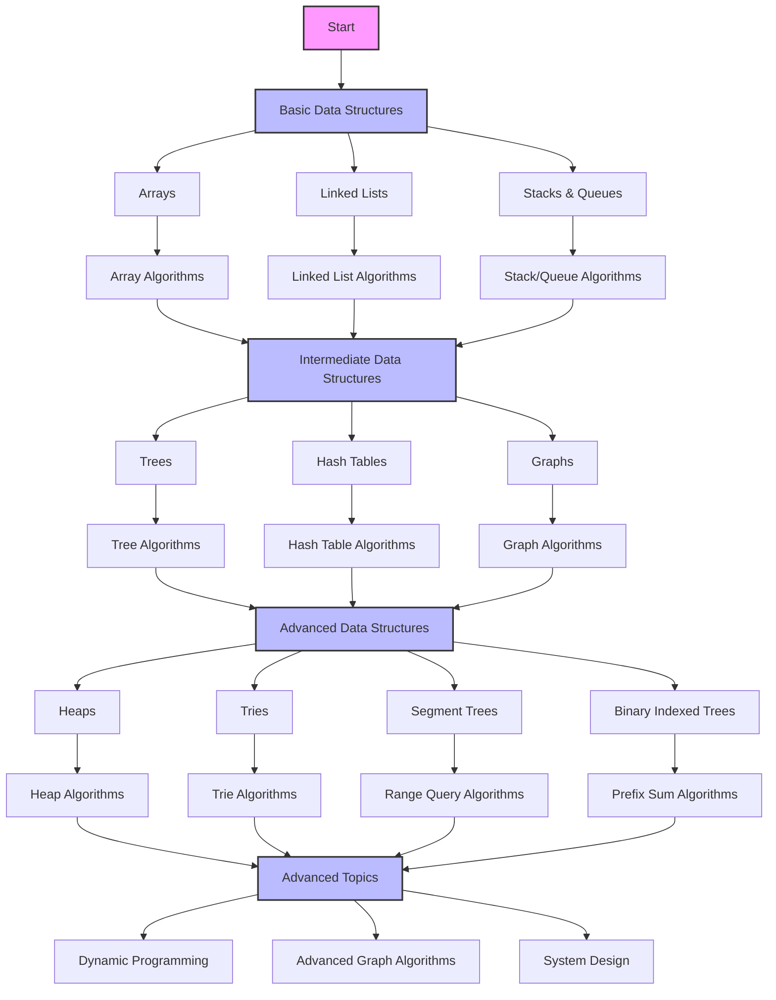

# Data Structures and Algorithms Guide

## Learning Flow

## Data Structures

### Linear Structures
- [[../Data Structures/Arrays|Arrays]]
- [[../Data Structures/LinkedLists|Linked Lists]]
- [[../Data Structures/Stacks_Queues|Stacks and Queues]]

### Tree-Based Structures
- [[../Data Structures/Trees|Trees]]
- [[../Data Structures/Heaps|Heaps]]
- [[../Data Structures/Tries|Tries]]
- [[../Data Structures/Segment_Trees|Segment Trees]]
- [[../Data Structures/Binary_Indexed_Trees|Binary Indexed Trees]]

### Graph Structures
- [[../Data Structures/Graphs|Graphs]]
  - Adjacency List
  - Adjacency Matrix
  - Edge List
  - Incidence Matrix

### Hash-Based Structures
- [[../Data Structures/HashTables|Hash Tables]]

### Specialized Structures
- [[../Data Structures/Disjoint_Sets|Disjoint Sets]]
- [[../Data Structures/Skip_Lists|Skip Lists]]
- [[../Data Structures/Bloom_Filters|Bloom Filters]]
- [[../Data Structures/Circular_Buffers|Circular Buffers]]

## Algorithms

### Array Algorithms
- [[../Algorithms/Array_Problems|Array Problems]]
  - Two Pointers
  - Sliding Window
  - Prefix Sums
  - Kadane's Algorithm

### Linked List Algorithms
- [[../Algorithms/LinkedList_Problems|Linked List Problems]]
  - Fast and Slow Pointers
  - Pointer Manipulation
  - Cycle Detection
  - List Reversal

### Tree Algorithms
- [[../Algorithms/Tree_Problems|Tree Problems]]
  - Tree Traversal
  - Graph Algorithms
  - Tree Properties
  - Path Finding

### Graph Algorithms
- [[../Algorithms/Graph_Problems|Graph Problems]]
  - BFS/DFS
  - Shortest Path
  - Minimum Spanning Tree
  - Topological Sort
  - Strongly Connected Components

### Hash Table Algorithms
- [[../Algorithms/HashTable_Problems|Hash Table Problems]]
  - Frequency Counting
  - Two Sum Variations
  - Caching
  - Collision Resolution

### Stack and Queue Algorithms
- [[../Algorithms/StackQueue_Problems|Stack and Queue Problems]]
  - LIFO/FIFO Operations
  - Monotonic Stacks
  - Expression Evaluation
  - Parentheses Matching

### Heap Algorithms
- [[../Algorithms/Heap_Problems|Heap Problems]]
  - Priority Queue Operations
  - K-Element Problems
  - Stream Processing
  - Sorting

### Trie Algorithms
- [[../Algorithms/Trie_Problems|Trie Problems]]
  - String Operations
  - Word Games
  - Text Processing
  - Pattern Matching

### Range Query Algorithms
- [[../Algorithms/Range_Query_Problems|Range Query Problems]]
  - Segment Tree Operations
  - Binary Indexed Tree Operations
  - Sparse Table
  - Mo's Algorithm

## Problem Categories

### Easy Problems
- [ ] Array manipulation
- [ ] String operations
- [ ] Basic linked list
- [ ] Simple tree traversal
- [ ] Hash table usage

### Medium Problems
- [ ] Advanced array techniques
- [ ] Complex string manipulation
- [ ] Linked list operations
- [ ] Tree and graph algorithms
- [ ] Dynamic programming basics

### Hard Problems
- [ ] Complex array algorithms
- [ ] Advanced string algorithms
- [ ] Sophisticated tree/graph problems
- [ ] Complex dynamic programming
- [ ] System design integration

## Progress Tracking

### Data Structures
- [ ] Arrays and Strings
- [ ] Linked Lists
- [ ] Stacks and Queues
- [ ] Trees and Graphs
- [ ] Hash Tables
- [ ] Heaps
- [ ] Tries
- [ ] Segment Trees
- [ ] Binary Indexed Trees
- [ ] Disjoint Sets
- [ ] Skip Lists
- [ ] Bloom Filters

### Algorithm Patterns
- [ ] Two Pointers
- [ ] Sliding Window
- [ ] Tree Traversal
- [ ] Graph Algorithms
- [ ] Dynamic Programming
- [ ] Greedy Algorithms
- [ ] Backtracking
- [ ] Range Queries
- [ ] Union-Find
- [ ] String Matching

## Related Notes
- [[US_Transition_Interview_Prep|Interview Preparation]]
- [[US_Transition_Technical_Skills|Technical Skills Development]]
- [[US_Transition_Resources|Additional Resources]]

## Notes
- Practice daily
- Focus on understanding patterns
- Review solutions thoroughly
- Time your practice
- Track your progress 

#DSA